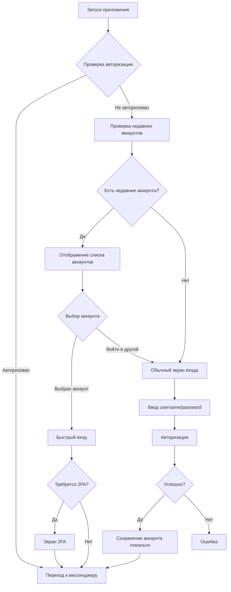

# План реализации недавних аккаунтов и авторизации

## Обзор

Реализация системы недавних аккаунтов для мобильного приложения Xaneo. Пользователи смогут видеть аккаунты, в которые они входили ранее на этом устройстве, и быстро входить в них.

## Архитектура



## Структура данных

### 1. RecentAccount (модель)

```dart
class RecentAccount {
  final int id;
  final String username;
  final String email;
  final String? avatar;
  final DateTime lastLogin;
  final DateTime firstLogin;
  
  // Локальные данные (не с сервера)
  final String? avatarGradient; // Для отображения градиента
  final bool hasAvatar;
}
```

### 2. RecentAccountsService (сервис)

Методы:
- `Future<List<RecentAccount>> getRecentAccounts()` - получение с сервера
- `Future<List<RecentAccount>> getLocalRecentAccounts()` - из локального хранилища
- `Future<void> saveAccountLocally(RecentAccount account)` - сохранение локально
- `Future<void> removeAccountLocally(int userId)` - удаление локально
- `Future<void> syncWithServer()` - синхронизация с сервером

### 3. QuickLoginResponse (модель ответа)

```dart
class QuickLoginResponse {
  final bool success;
  final bool? requires2fa;
  final String? message;
  final UserInfo? userInfo;
  final String? error;
  final String? code;
}
```

## Эндпоинты API

### GET /api/v1/auth/recent-accounts/

Headers:
- `User-Agent: XaneoMobile/2.0`

Response:
```json
{
  "success": true,
  "recent_accounts": [
    {
      "id": 1,
      "username": "user1",
      "email": "user1@example.com",
      "avatar": "https://.../avatar.jpg",
      "last_login": "2024-01-01T12:00:00Z",
      "first_login": "2024-01-01T10:00:00Z"
    }
  ],
  "count": 1
}
```

### POST /api/v1/auth/quick-login/

Request:
```json
{
  "user_id": 1,
  "tfa_code": "123456" // опционально
}
```

Response (успех):
```json
{
  "success": true,
  "message": "Успешный вход",
  "user_info": {
    "id": 1,
    "username": "user1",
    "email": "user1@example.com",
    "first_name": "Иван",
    "is_verified": true,
    "tfa_enabled": false,
    "has_avatar": true,
    "avatar_url": "https://.../avatar.jpg"
  }
}
```

Response (требуется 2FA):
```json
{
  "success": false,
  "requires_2fa": true,
  "message": "Требуется код 2FA. Код отправлен на вашу почту.",
  "user_info": {
    "username": "user1",
    "email": "us***@example.com",
    "tfa_enabled": true
  }
}
```

## Файлы для создания/изменения

### Новые файлы:

1. **lib/models/auth/recent_account.dart** - модель недавнего аккаунта
2. **lib/services/auth/recent_accounts_service.dart** - сервис для работы с недавними аккаунтами
3. **lib/screens/auth/recent_accounts_screen.dart** - экран выбора недавнего аккаунта

### Изменяемые файлы:

1. **lib/config/app_config.dart** - добавить эндпоинты
2. **lib/services/auth/auth_service.dart** - добавить методы для quick-login
3. **lib/providers/auth_provider.dart** - добавить методы для quick-login
4. **lib/screens/auth/login_screen.dart** - интеграция недавних аккаунтов
5. **lib/main.dart** или **lib/app.dart** - проверка авторизации при запуске

## Порядок реализации

### Этап 1: Модели и конфигурация
- [ ] Создать `RecentAccount` модель
- [ ] Создать `QuickLoginResponse` модель
- [ ] Добавить эндпоинты в `AppConfig`

### Этап 2: Сервис недавних аккаунтов
- [ ] Создать `RecentAccountsService`
- [ ] Реализовать локальное хранение (SecureStorage)
- [ ] Реализовать получение с сервера
- [ ] Реализовать синхронизацию

### Этап 3: Auth Service
- [ ] Добавить метод `getRecentAccounts()`
- [ ] Добавить метод `quickLogin()`

### Этап 4: UI
- [ ] Создать экран недавних аккаунтов
- [ ] Интегрировать в login_screen.dart
- [ ] Добавить сохранение аккаунта при успешном входе

### Этап 5: Проверка авторизации при запуске
- [ ] Добавить проверку в main.dart
- [ ] Автоматический переход к мессенджеру если авторизован

## Локальное хранение

Используем `flutter_secure_storage` для безопасного хранения:

Ключи:
- `recent_accounts` - JSON список недавних аккаунтов
- `last_sync_time` - время последней синхронизации

Формат хранения:
```json
[
  {
    "id": 1,
    "username": "user1",
    "email": "user1@example.com",
    "avatar": "https://...",
    "last_login": "2024-01-01T12:00:00Z",
    "first_login": "2024-01-01T10:00:00Z",
    "avatar_gradient": "#FF5733|#33FF57",
    "has_avatar": true
  }
]
```

## Безопасность

1. **Rate Limiting**: 5 попыток за 5 минут
2. **Локальное хранение**: SecureStorage (зашифровано)
3. **Проверка устройства**: Device fingerprint на сервере
4. **2FA**: Поддержка двухфакторной авторизации

## Тестирование

1. Первый вход - сохранение аккаунта
2. Повторный вход - отображение в списке
3. Быстрый вход без 2FA
4. Быстрый вход с 2FA
5. Удаление аккаунта на сервере - синхронизация
6. Очистка локальных данных
